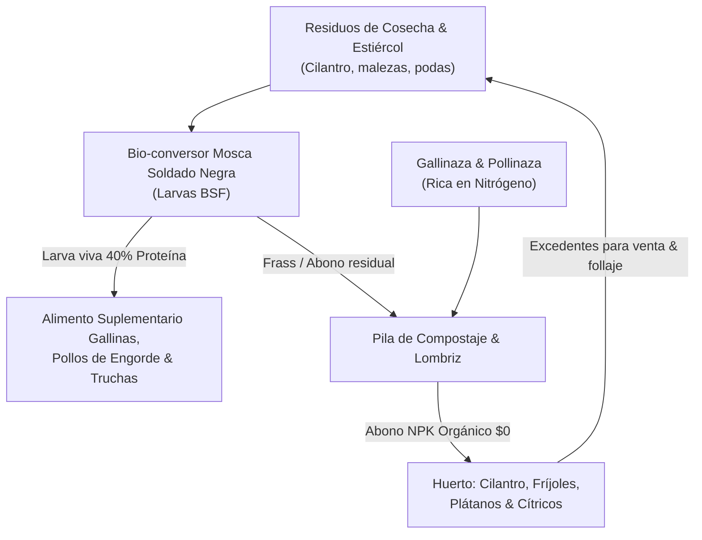
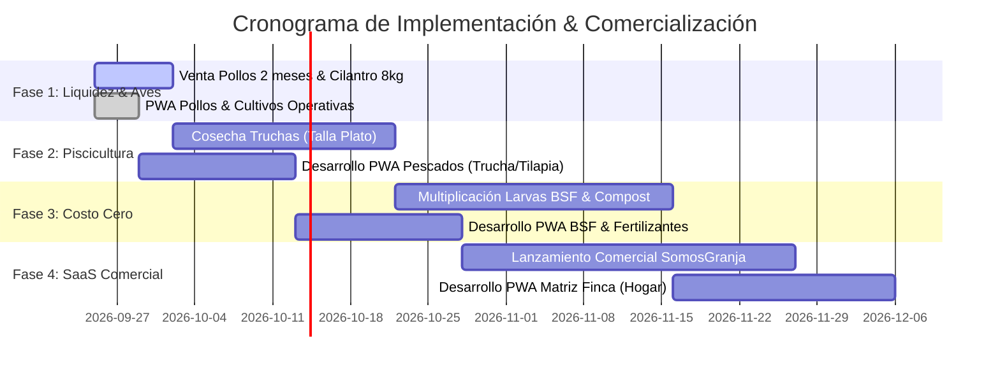

# 🌾 Master Plan AgroSuite & Estrategia Comercial SaaS
> **Ubicación:** Granja a 2.200 msnm (Piso térmico frío andino, 13°C – 17°C)  
> **Plataforma:** Granja OS / SomosGranja Suite  
> **Modelo Tecnológico:** Local-First PWA (Offline) + Supabase Cloud + Multi-Tenant SaaS  
> **Fecha de Actualización:** Septiembre 2026

---

## 🧭 Índice General
1. [Resumen Ejecutivo & Visión Comercial](#1-resumen-ejecutivo--visión-comercial)
2. [Diagnóstico Agroecológico & Priorización Estratégica (2.200 msnm)](#2-diagnóstico-agroecológico--priorización-estratégica-2200-msnm)
3. [El Ciclo de Economía Circular (Alimento a Costo $0)](#3-el-ciclo-de-economía-circular-alimento-a-costo-0)
4. [Arquitectura Técnica de Software (Local-First PWA)](#4-arquitectura-técnica-de-software-local-first-pwa)
5. [Estrategia para Vender como Software (SaaS Agropecuario)](#5-estrategia-para-vender-como-software-saas-agropecuario)
6. [Roadmap de Ejecución por Fases](#6-roadmap-de-ejecución-por-fases)

---

## 1. Resumen Ejecutivo & Visión Comercial

Este proyecto tiene una **doble misión**:
1. **A nivel de Granja Real:** Maximizar la rentabilidad neta de la finca a 2.200 msnm mediante la diversificación productiva, venta directa local en pueblo/vereda, reducción radical del gasto en concentrado comercial (purina) y control estricto de caja separando las utilidades del negocio de los gastos del hogar.
2. **A nivel de Producto de Software:** Convertir las soluciones operativas que resuelven los problemas reales de la finca en una **Suite SaaS Modular B2B/B2C** vendible a otros campesinos, productores independientes, asociaciones avícolas/piscícolas y cooperativas agropecuarias en Colombia y Latinoamérica.

---

## 2. Diagnóstico Agroecológico & Priorización Estratégica (2.200 msnm)

A 2.200 metros sobre el nivel del mar, el clima frío (13°C - 17°C) y la menor presión de oxígeno determinan qué negocios son altamente rentables y cuáles representan riesgo biológico:

| Línea de Negocio | Estado Biológico | Diagnóstico Zootécnico / Agronómico | Prioridad Inmediata | Margen Estimado | Demanda Comercial Local |
| :--- | :--- | :--- | :--- | :--- | :--- |
| **Gallinas Ponedoras** | Producción activa | Clima ideal. Las ponedoras se adaptan muy bien al frío. Flujo de caja diario con venta de huevo por cubeta/canasta de 30. | **Mantener & Optimizar** | 28% – 35% | **Diaria y recurrente** en tiendas, panaderías y vecinos. |
| **Pollos de Engorde** | 2 meses de edad (8–9 sem) | **PUNTO CRÍTICO DE COSECHA**. A 2.200 msnm el riesgo de ascitis (muerte súbita o acumulación de líquido por hipoxia/frío) se dispara tras la semana 7. Mantenerlos vivos solo consume bultos de purina sin conversión de peso eficiente. | 🔴 **URGENCIA FASE 1** (Sacrificio / Venta en pie inmediata) | 22% – 30% | **Altísima** en fines de semana (asaderos, familias, restaurantes). |
| **Cilantro** | 8 kg listos | Cultivo de ciclo ultra-rápido en frío. Perecedero: debe cosecharse y comercializarse de inmediato en fresco. | 🔴 **VENTA INMEDIATA** (Hoy / Mañana) | > 60% | Inmediata en tiendas de barrio y legumbrerías del pueblo. |
| **Truchas** | 5 meses de edad | **La reina de los 2.200 msnm**. El agua fría (12°C - 15°C) con buen caudal es el hábitat perfecto. Entrando a talla comercial de plato (250g - 300g). | 🟡 **FASE 2** (Cosecha mes 5.5 a 6) | 35% – 45% | Alta en restaurantes de carretera, turismo de pesca y asaderos locales. |
| **Tilapias** | 3 meses (Invernadero) | Especie de agua cálida. Solo viable a 2.200 msnm gracias a que está bajo plástico/invernadero. Requiere monitoreo térmico del agua. | 🟡 **FASE 2** (Cosecha mes 6 a 7) | 30% – 38% | Media-Alta local. |
| **Mosca Soldado Negra (BSF)** | Adultos ovipositando | **El motor de ahorro de la granja**. Bioconversión de residuos orgánicos a larvas vivas con 40% de proteína bruta para sustituir el 20-30% del concentrado avícola y piscícola. | 🟢 **FASE 3** (Cosecha continua de larvas & cría) | Ahorro 25% purina (\$0 costo insumo) | Autoconsumo interno + Venta de pie de cría a otros granjeros. |
| **Fertilizantes Orgánicos** | Gallinaza + Frass BSF | Subproducto de alto valor NPK. Compostaje térmico en pilas aireadas para autoconsumo en frutales y venta de bultos sobrantes. | 🟢 **FASE 3** (Maduración y empaque en bultos) | > 70% | Media-Alta en veredas vecinas para pastos y cultivos. |
| **Cultivos (Plátano, Banano, Frijol, Limón)** | 20 plátanos + 20 bananos sembrados, frijol andino | Ciclo lento a 2.200 msnm (14 a 18 meses para musáceas; 3.5 a 4 meses para frijol). Mínimo esfuerzo de mano de obra (mantenimiento pasivo). | ⚪ **FASE 4** (Mantenimiento y aporque) | 40% – 50% | Consumo propio + venta estacional de excedentes. |
| **Lácteos / Ganadería** | Sin iniciar | Requiere gran capital en semovientes, adecuación intensiva de praderas y ordeño fijo a las 4:00 AM. Se pospone para no ahogar la liquidez. | ⏸️ **POSPUESTO** | N/A | N/A |
| **Finca (Hogar & Caja Matriz)** | En estructuración | **NO ES UNA LÍNEA COMERCIAL**. Es la cuenta de tesorería matriz que consolida los dividendos de cada línea y los gastos familiares/hogar. | 🏛️ **TRANSVERSAL** | Control Patrimonial | Caja Central |

---

## 3. El Ciclo de Economía Circular (Alimento a Costo $0)

El mayor drenaje de dinero en cualquier granja es la **purina o concentrado comercial** (65% al 75% de los costos operativos). La estrategia de la finca consiste en cerrar el ciclo biológico para que los residuos de un módulo alimenten al siguiente:



- **Impacto Financiero:** Ahorro directo estimado de **\$400.000 a \$800.000 COP mensuales** en concentrado comercial por cada 200 aves/peces.
- **Ventaja de Mercado:** Pollo, huevo y trucha con sello *"Alimentados con proteína viva y criados sin antibióticos"*, permitiendo cobrar un sobreprecio del 15% al 25% respecto al producto industrial de supermercado.

---

## 4. Arquitectura Técnica de Software (Local-First PWA)

Cada línea de negocio opera como una aplicación web progresiva independiente bajo su propio subdominio, compartiendo el mismo núcleo tecnológico:

```
Dev-Projects/GALLINAS/
├── MASTER_PLAN_GRANJA_SAAS.md    # Este Plan Estratégico y Técnico
├── gallinas/                     # PWA Gallinas Ponedoras (gallinas.somosgranja.com)
├── pollos/                       # PWA Pollos de Engorde (pollos.somosgranja.com)
├── cultivos/                     # PWA Huerto & Cosechas (cultivos.somosgranja.com)
├── pescados/                     # PWA Acuicultura Truchas/Tilapias (pescados.somosgranja.com)
├── mosca soldado negra/          # PWA Bioconversión BSF (mosca.somosgranja.com)
├── fertilizantes/                # PWA Compostaje & Abonos (abonos.somosgranja.com)
├── finca/                        # PWA Matriz: Consolidado & Caja Hogar (finca.somosgranja.com)
└── packages/                     # Lógica universal reutilizable (@granja/core)
```

### Pilares Técnicos Fundamentales:
1. **Local-First & 100% Offline (Dexie.js / IndexedDB):**
   - El campesino o trabajador en el galpón rural registra huevos, pesajes, alimento o ventas **sin necesidad de señal o internet**.
   - Los datos se guardan en el almacenamiento local del teléfono con latencia de 0 ms.
2. **Sincronización en la Nube (Supabase PostgreSQL):**
   - Una sola base de datos PostgreSQL en Supabase gestiona todas las líneas productivas mediante multi-tenancy (`finca_id`), optimizando costos de infraestructura (cero sobrecostos de múltiples proyectos).
   - Cuando el celular detecta Wi-Fi o datos celulares, el Service Worker y el motor de sincronización suben los registros automáticamente.
3. **PWA Instalable con 1 Toque (Android / iOS):**
   - Manifiesto estándar (`manifest.webmanifest`), `sw.js` con precache de la cáscara y componente `InstallPwaBanner.tsx`.
   - Se instala como cualquier app nativa descargada de Google Play o App Store, con icono propio en la pantalla de inicio y navegación en pantalla completa sin barra del navegador.
4. **Seguridad y Confidencialidad por Roles (RBAC):**
   - **Administrador (Dueño):** Visualiza márgenes de ganancia, costos al por mayor de bultos, payback del lote y flujo de caja en efectivo vs transferencias.
   - **Operador de Galpón / Campo:** Solo tiene botones para ingresar tareas físicas (kilos de purina servidos, mortalidad del día, kilos cosechados). Jamás ve utilidades ni precios de costo.
   - **Repartidor:** Visualiza la ruta de clientes, pedidos pendientes, huevos/pollos entregados y cobros realizados.
5. **Botonera Táctil Ergonómica ("1 Toque"):**
   - Diseñada para operarse con una sola mano y dedos sucios o con guantes en medio del campo.
   - Integración nativa con WhatsApp: genera recibos de venta y cobro formateados para enviar con 1 toque al cliente sin necesidad de impresora térmica.

---

## 5. Estrategia para Vender como Software (SaaS Agropecuario)

### A. El Dolor del Mercado Campesino
El pequeño y mediano productor agropecuario (avicultor, piscicultor, agricultor) en Colombia y América Latina:
- Lleva sus cuentas en cuadernos de papel que se mojan, pierden o ensucian.
- No sabe con exactitud cuánto dinero le cuesta producir un kilo de pollo, una trucha o una cubeta de huevos.
- Intenta usar Excel en computadores de escritorio, pero en el campo nadie lleva un computador al galpón.
- Los softwares empresariales tradicionales (SAP, Siigo agropecuario, monolitos de escritorio) son costosos, difíciles de configurar y exigen internet permanente.

### B. Nuestra Propuesta de Valor Única (UVP)
> **"El sistema operativo de la granja que cabe en tu bolsillo, funciona sin internet en el galpón y te dice exactamente cuánto ganas con cada animal o cosecha."**

### C. Modelo de Precios y Empaquetamiento (Pricing SaaS)
En lugar de vender un software monstruoso y caro, se vende **por módulo productivo**:

| Plan | Enfoque | Precio Sugerido (COP) | Precio Sugerido (USD) | Características |
| :--- | :--- | :--- | :--- | :--- |
| **Freemium / Prueba** | Entrada y adopción | **$0 COP** (15 días) | **$0 USD** | 1 lote activo, registro básico de producción y ventas offline. |
| **Módulo Individual** (ej. Solo Pollos o Solo Gallinas) | Monoproductor local | **$29.000 COP / mes** (o \$290.000 / año) | **$8 USD / mes** | Lotes ilimitados, WhatsApp recibos, proyecciones de peso/postura, métricas de costos, soporte offline. |
| **Doble Módulo** (ej. Aves + Huerto) | Finca diversificada | **$49.000 COP / mes** | **$14 USD / mes** | 2 aplicaciones conectadas, libreta unificada de clientes, control de abonos. |
| **Suite Completa Granja OS** | Finca agropecuaria integral | **$79.000 COP / mes** | **$22 USD / mes** | Acceso a todas las apps (Gallinas, Pollos, Peces, Cultivos, Mosca, Fertilizantes) + App Matriz Finca con Balance General consolidado. |
| **Plan Gremio / Cooperativa** | Asociaciones o Alcaldías | **A convenir** (\$500k – \$2M COP/mes) | **$150 – $600 USD/mes** | Dashboard multi-granjero para ver estadísticas agregadas de producción en la región. |

### D. Estrategia de Comercialización y Ventas (Go-to-Market)
1. **El Showroom en Vivo (Tu Granja como Laboratorio):**
   - Tu finca es el caso de éxito número 1. Fotos, videos de pesaje con la app en mano y testimonios reales en TikTok, Instagram y YouTube Shorts demostrando cómo se controla la producción desde el celular.
2. **Canal de Almacenes de Insumos Agropecuarios & Veterinarias:**
   - Colocar carteles con código QR en los mostradores donde los campesinos compran el concentrado (Italcol, Solla, Contegral, Finca) en los pueblos:  
     *“¿Sabes cuánto te cuesta cada kilo de pollo o cubeta de huevo? Descarga gratis la app en tu celular y compruébalo”*.
   - Comisión del 15% al dependiente o veterinario por cada suscripción anual que refiera.
3. **Distribución Digital Viral (WhatsApp & PWA Directa):**
   - Sin pasar por las trabas de Google Play o Apple Store que cobran 30% de comisión: el cliente entra al enlace (ej. `pollos.somosgranja.com`), toca **"Instalar"** y la app queda funcionando en su teléfono en 5 segundos.
   - Cobros recurrentes automáticos mediante pasarelas locales (Wompi, MercadoPago, PSE, Nequi, Tarjeta).

---

## 6. Roadmap de Ejecución por Fases



### Resumen de Acciones Inmediatas:
1. **Sacrificar / Vender los Pollos de 2 meses** en canal o en pie a clientes locales del pueblo para asegurar liquidez inmediata y frenar el gasto de concentrado.
2. **Cosechar los 8 kg de cilantro** y venderlos hoy mismo a tiendas o legumbrerías locales registrando el ingreso en la PWA de `cultivos`.
3. **Muestrear biométricamente las Truchas de 5 meses** para agendar entrega a restaurantes locales en 2 a 3 semanas.
4. **Arrancar el desarrollo del módulo `pescados/`** replicando la arquitectura offline-first de `gallinas`, `pollos` y `cultivos`.

---
*Este documento es el manifiesto operativo y comercial de la granja y software. Debe actualizarse al alcanzar cada hito zootécnico o hito de ventas de software.*
